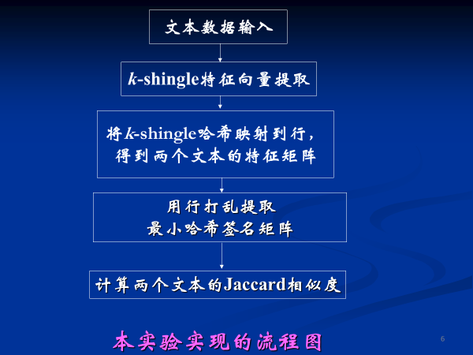
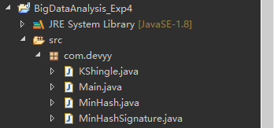
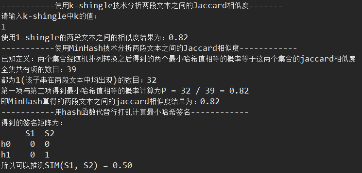

# 实时大数据分析实验四——文本相似-Shingling、Minhash算法
## 一、实验内容

采用Shinling及Minhash技术分析以下两段文本的Jaccard相似度：

(1)	The TOEFL test is an English language assessment that is often required for admission by English-speaking universities and programs around the world. In addition to being accepted at more than 10,000 institutions in over 130 countries, including Australia, Canada, and the US, TOEFL scores help you get noticed by admissions officers who consider the TOEFL test a more accurate measure of your ability to succeed in a university setting.

(2)	The TOEFL test is the most widely respected English-language test in the world, recognized by more than 10,000 colleges, universities and agencies in more than 130 countries, including Australia, Canada, the U.K. and the United States. Wherever you want to study, the TOEFL test can help you get there.

## 二、实验设计（原理分析及流程）

## 三、实验代码及数据记录
### 1.代码 

#### 1.0 文件结构图

#### 1.1 KShingle.java
	
	package com.devyy;
	
	import java.io.IOException;
	import java.text.DecimalFormat;
	import java.util.Set;
	import java.util.TreeSet;
	
	public class KShingle {
	
		// 文本一
		protected static final String str1 = "The TOEFL test is an English language assessment that is often required for admission by "
				+ "English-speaking universities and programs around the world. In addition to being accepted at "
				+ "more than 10,000 institutions in over 130 countries, including Australia, Canada, and the US, "
				+ "TOEFL scores help you get noticed by admissions officers who consider the TOEFL test a more "
				+ "accurate measure of your ability to succeed in a university setting.";
	
		// 文本二
		protected static final String str2 = "The TOEFL test is the most widely respected English-language test in the world, recognized by "
				+ "more than 10,000 colleges, universities and agencies in more than 130 countries, including "
				+ "Australia, Canada, the U.K. and the United States. Wherever you want to study, the TOEFL "
				+ "test can help you get there.";	
	
		// 删除停用词及空格符(仅针对本样例文本)
		protected static String deleteWord(String str) {
			String replaceStr = str.replaceAll("and ", "").replaceAll("by ", "").replaceAll("the ", "")
					.replaceAll("of ", "").replace("with ", "").replaceAll("\\)", "").replaceAll("\\(", "")
					.replaceAll(",", "").replaceAll("\\D\\.", "").replaceAll("\\s", "");
			return replaceStr;
		}
	
		// 使用k-shingle算法分隔
		protected static Set<String> split(String str, int k) {
			Set<String> shingSet = new TreeSet<String>();// 使用TreeSet而不使用HashSet有利于在MinHash算法中降低算法复杂度
			for (int i = 0; i <= str.length() - k; i++) {
				shingSet.add(str.substring(i, i + k));
			}
			return shingSet;
		}
	
		// 获得两段文本之间的相似度
		protected static Set<String> jaccard(int k) throws IOException {
			String replacedStr1 = deleteWord(str1);
			String replacedStr2 = deleteWord(str2);
			Set<String> set1 = split(replacedStr1, k);
			Set<String> set2 = split(replacedStr2, k);
			Set<String> allElementSet = new TreeSet<String>();
			allElementSet.addAll(set1);
			allElementSet.addAll(set2);
			double jaccardValue = (set1.size() + set2.size() - allElementSet.size()) * 1.0 / allElementSet.size();
			DecimalFormat df = new DecimalFormat("0.00");
			System.out.println("使用" + k + "-shingle的两段文本之间的相似度结果为：" + df.format(jaccardValue));
			return allElementSet;
		}
	}

#### 1.2 Main.java

	package com.devyy;
	
	import java.io.IOException;
	import java.util.Scanner;
	import java.util.Set;
	
	public class Main {
		public static void main(String[] args) throws IOException {  
	        System.out.println("-----------使用k-shingle技术分析两段文本之间的Jaccard相似度-------");  
	        System.out.println("请输入k-shingle中k的值：");  
	        Scanner scann = new Scanner(System.in);  
	        int k = scann.nextInt();  
	        scann.close();  
	        Set<String> set = KShingle.jaccard(k);  
	        System.out.println("-----------使用MinHash技术分析两段文本之间的Jaccard相似度------------");  
	        MinHash.minHashJaccard(k, set);  
	        System.out.println("-----------用hash函数代替行打乱计算最小哈希签名------------");  
	        MinHashSignature.signatureJaccard(set, k);  
	    }  
	}

#### 1.3 MinHash.java

	package com.devyy;
	
	import java.io.IOException;
	import java.text.DecimalFormat;
	import java.util.Iterator;
	import java.util.Random;
	import java.util.Set;
	
	public class MinHash {
		// 得到set  
	    protected static Set<String> getSet(int k, String str) throws IOException{  
	        String replacedStr = KShingle.deleteWord(str);  
	        Set<String> set = KShingle.split(replacedStr, k);  
	        return set;  
	    }  
	      
	    // 构建特征集合矩阵  
	    protected static String[][] characteristicMatrix(Set<String> set, Set<String> set1, Set<String> set2){  
	        String[] a = new String[set.size()];  
	        set.toArray(a);  
	        String[] set1Array = new String[set1.size()];  
	        set1.toArray(set1Array);  
	        String[] set2Array = new String[set2.size()];  
	        set2.toArray(set2Array);  
	        String[][] matrix = new String[a.length][5];//此处构造为5是为了后面的最小哈希签名中的两个哈希函数的结果存放。  
	        int i, j, temp;  
	        for(i = 0; i < matrix.length; i++){  
	            for(j = 0; j < matrix[0].length; j++){  
	                matrix[i][j] = "0";  
	            }  
	        }  
	        i = 0;  
	        for(Iterator<String> iter = set.iterator(); iter.hasNext();){  
	            matrix[i++][0] = iter.next();  
	        }  
	        i = 0;  
	        temp = 0;  
	        for(j = i; j < a.length && temp < set1Array.length; j++){  
	            if(matrix[j][0].equals(set1Array[temp])){  
	                matrix[j][1] = "1";  
	                temp++;  
	            }  
	        }  
	        temp = 0;  
	        for(j = i; j < a.length && temp < set2Array.length; j++){  
	            if(matrix[j][0].equals(set2Array[temp])){  
	                matrix[j][2] = "1";  
	                temp++;  
	            }  
	        }  
	        return matrix;  
	    }  
	      
	    // 行打乱  
	    protected static String[][] rowMess(String[][] matrix){  
	        int rowNumber1, rowNumber2;  
	        int i, j;  
	        String temp;  
	        Random r = new Random();  
	        //随机进行行打乱十次  
	        for(i = 0; i < 9; i++){  
	            rowNumber1 = r.nextInt(matrix.length);  
	            rowNumber2 = r.nextInt(matrix.length);  
	            for(j = 0; j < matrix[0].length; j ++){  
	                temp = matrix[rowNumber2][j];  
	                matrix[rowNumber2][j] = matrix[rowNumber1][j];  
	                matrix[rowNumber1][j] = temp;  
	            }  
	        }  
	        return matrix;  
	    }  
	      
	    // 根据最小hash值求相似度  
	    protected static double minHashJaccard(int k, Set<String> set) throws IOException{  
	        Set<String> set1 = getSet(k, KShingle.str1);  
	        Set<String> set2 = getSet(k, KShingle.str2);  
	        String[][] matrix = characteristicMatrix(set, set1, set2);  
	        matrix = rowMess(matrix);  
	        double result;  
	        System.out.println("已知定义：两个集合经随机排列转换之后得到的两个最小哈希值相等的概率等于这两个集合的jaccard相似度");  
	        int equalHashValue = 0;  
	        for(int i = 0; i < matrix.length; i++){  
	            if(matrix[i][1].equals(matrix[i][2]) && matrix[i][1].equals("1")){  
	                equalHashValue++;  
	            }  
	        }  
	        System.out.println("全集共有项的数目：" + set.size());  
	        System.out.println("都为1(该子串在两段文本中均出现)的数目：" + equalHashValue);  
	        result = equalHashValue * 1.0 / set.size();  
	        DecimalFormat df = new DecimalFormat("0.00");  
	        System.out.println("第一项与第二项得到最小哈希值相等的概率计算为P = " + equalHashValue + " / "  + set.size() + " = " + df.format(result));  
	        System.out.println("即MinHash算得的两段文本之间的jaccard相似度结果为：" + df.format(result));  
	        return equalHashValue;  
	    }  
	}

#### 1.4 MinHashSignature.java
	
	package com.devyy;
	
	import java.io.IOException;
	import java.text.DecimalFormat;
	import java.util.Set;
	
	public class MinHashSignature {
		protected static final int INF = 10000;
	
		// 构造出特征矩阵
		protected static String[][] createCharacteristicMatrix(Set<String> set, int k) throws IOException {
			Set<String> set1 = MinHash.getSet(k, KShingle.str1);
			Set<String> set2 = MinHash.getSet(k, KShingle.str2);
			String[][] matrix = MinHash.characteristicMatrix(set, set1, set2);
			return matrix;
		}
	
		// 将哈希函数h1(r)=(3r +1) mod 7，h2(r)=(5r +1) mod 7的结果加入
		protected static String[][] addHashFunction(String[][] matrix) {
			for (int i = 0; i < matrix.length; i++) {
				matrix[i][3] = Integer.toString((3 * i + 1) % 7);
				matrix[i][4] = Integer.toString((5 * i + 1) % 7);
			}
			return matrix;
		}
	
		// 签名矩阵的计算算法
		protected static int[][] signatureCount(String[][] matrix) {
			int[][] signatureMatrix = new int[][] { { INF, INF }, { INF, INF } };
			int i, j;
			for (i = 0; i < matrix.length; i++) {
				if (matrix[i][1].equals("1") && Integer.valueOf(matrix[i][3]) <= signatureMatrix[0][0]) {
					signatureMatrix[0][0] = Integer.valueOf(matrix[i][3]);
				}
				if (matrix[i][1].equals("1") && Integer.valueOf(matrix[i][4]) <= signatureMatrix[1][0]) {
					signatureMatrix[1][0] = Integer.valueOf(matrix[i][4]);
				}
				if (matrix[i][2].equals("1") && Integer.valueOf(matrix[i][3]) <= signatureMatrix[0][1]) {
					signatureMatrix[0][1] = Integer.valueOf(matrix[i][3]);
				}
				if (matrix[i][2].equals("1") && Integer.valueOf(matrix[i][4]) <= signatureMatrix[1][1]) {
					signatureMatrix[1][1] = Integer.valueOf(matrix[i][3]);
				}
			}
			System.out.println("得到的签名矩阵为：");
			System.out.println("     S1  S2");
			for (i = 0; i < signatureMatrix.length; i++) {
				System.out.print("h" + i + "    ");
				for (j = 0; j < signatureMatrix[0].length; j++) {
					System.out.print(signatureMatrix[i][j] + "  ");
				}
				System.out.println();
			}
			return signatureMatrix;
		}
	
		// 求jaccard相似度
		protected static double signatureJaccard(Set<String> set, int k) throws IOException {
			int count = 0;
			double result = 0.0;
			String[][] matrix = createCharacteristicMatrix(set, k);
			matrix = addHashFunction(matrix);
			int[][] signatureMatrix = signatureCount(matrix);
			for (int i = 0; i < signatureMatrix.length; i++) {
				if (signatureMatrix[i][0] == signatureMatrix[i][1]) {
					count++;
				}
			}
			result = count * 1.0 / signatureMatrix.length;
			DecimalFormat df = new DecimalFormat("0.00");
			System.out.println("所以可以推测SIM(S1, S2) = " + df.format(result));
			return result;
		}
	}

### 2.结果截图
（1）当k取值为1时，有：

（2）当k取值为2时，有：

（3）当k取值为3时，有：

